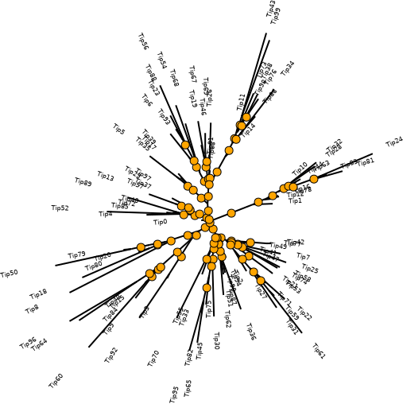
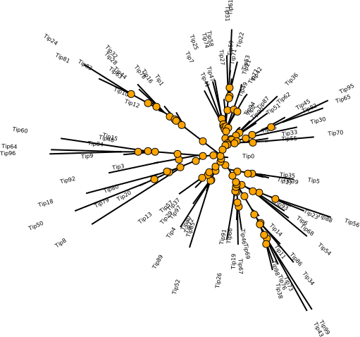

# Goalign: toolkit and api for alignment manipulation

## Commands

### build
This command builds bootstrap replicates from an input alignment (fasta or phylip) on different ways with different sub-commands:
1. `goalign build seqboot` : Builds bootstrap alignments from an input alignment (nt or aa). Sequence order may be shuffled with option `-S`. Output alignments may be written in compressed files (`--gz`) and/or added in a tar archive (`--tar`).
2. `goalign build distboot`: Builds bootstrap distance matrices based on different models, from an input alignment (nt only). It builds n bootstrap alignments and computes a distance matrix for each replicate. All distance matrices are written in the output file. If the input alignment file contains several alignments, it will take the first one only. The following models for distance computation are available:
    - pdist
    - jc   : Juke-Cantor
    - k2p  : Kimura 2 Parameters
    - f81  : Felsenstein 81
    - f84  : Felsenstein 84
    - tn93 : Tamura and Nei 1993

#### Usage

* General command
```
Usage:
  goalign build [command]

Available Commands:
  distboot    Builds bootstrap distances matrices
  seqboot     Builds bootstrap alignments

Flags:
  -h, --help   help for build

Global Flags:
  -i, --align string   Alignment input file (default "stdin")
  -p, --phylip         Alignment is in phylip? default=Fasta
  -t, --threads int    Number of threads (default 1)
```

* distboot command
```
Usage:
  goalign build distboot [flags]

Flags:
  -m, --model string    Model for distance computation (default "k2p")
  -n, --nboot int       Number of bootstrap replicates to build (default 1)
  -o, --output string   Distance matrices output file (default "stdout")
  -r, --rm-gaps         Do not take into account positions containing >=1 gaps
  -s, --seed int        Initial Random Seed (default: number of nanoseconds elapsed since January 1, 1970 UTC)

Global Flags:
  -i, --align string   Alignment input file (default "stdin")
  -p, --phylip         Alignment is in phylip? False=Fasta
  -t, --threads int    Number of threads (default 1)
```

* seqboot command
```
Usage:
  goalign build seqboot [flags]

Flags:
      --gz                  Will gzip output file(s). Maybe slow if combined with --tar (only one thread working for tar/gz)
  -n, --nboot int           Number of bootstrap replicates to build (default 1)
  -o, --out-prefix string   Prefix of output bootstrap files (default "none")
  -s, --seed int            Initial Random Seed (default; number of nanoseconds elapsed since January 1, 1970 UTC)
  -S, --shuf-order          Also shuffle order of sequences in bootstrap files
      --tar                 Will create a single tar file with all bootstrap alignments (one thread for tar, but not a bottleneck)

Global Flags:
  -i, --align string   Alignment input file (default "stdin")
  -p, --phylip         Alignment is in phylip? False=Fasta
  -t, --threads int    Number of threads (default 1)
```

#### Examples

* Generate a random tree with 100 leaves ([Gotree](https://github.com/fredericlemoine/gotree)), then simulate an alignment with 500 sites ([seq-gen](https://github.com/rambaut/Seq-Gen)), compute 100 bootstrap distance matrices with Goalign (f81 model and 10 threads), infer trees for all bootstrap distance matrices and for simulated alignment ([FastME](http://www.atgc-montpellier.fr/fastme/)), and compute bootstrap supports ([Gotree](https://github.com/fredericlemoine/gotree)):

```
gotree generate yuletree -l 100 -s 1 -o true_tree.nw
seq-gen -op -mGTR -l500 -z 2 -n 1 true_tree.nw > alignment.phy
goalign build distboot -i alignment.phy -m f81 -n 100 -o dist_boot.txt -p -t 10
fastme -i dist_boot.txt -D 100 -o boot_trees.nw
fastme -i alignment.phy -d1 -o inferred_tree.nw
gotree compute support classical -i inferred_tree.nw -b boot_trees.nw -o inferred_tree_supports.nw -t 10
```

Should give the following tree with branches having > 70% support highlighted. 



* Generate a random tree with 100 leaves ([Gotree](https://github.com/fredericlemoine/gotree)), then simulate an alignment with 500 sites ([seq-gen](https://github.com/rambaut/Seq-Gen)), compute 100 bootstrap alignments Goalign (f81 model and 10 threads), infer trees for all bootstrap alignments and for the simulated alignment ([FastTree](http://www.microbesonline.org/fasttree/)), and compute bootstrap supports ([Gotree](https://github.com/fredericlemoine/gotree)):

```
gotree generate yuletree -l 100 -s 1 -o true_tree.nw
seq-gen -op -mGTR -l500 -z 2 -n 1 true_tree.nw > alignment.phy
goalign build seqboot -i alignment.phy -p -n 100 -o seq_boot -S
cat seq_boot*.ph | FastTree -nt -n 100 -gtr > boot_trees.nw
FastTree -nt -gtr alignment.phy  > inferred_tree.nw
gotree compute support classical -i inferred_tree.nw -b boot_trees.nw -o inferred_tree_supports.nw -t 10
```

Should give the following tree with branches having > 70% support highlighted. 


