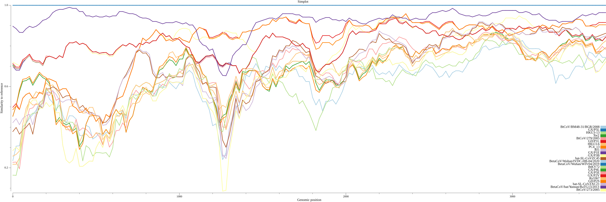
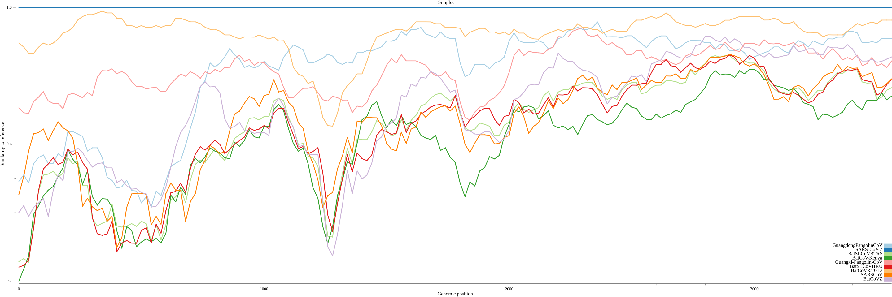

# Goalign: toolkit and api for alignment manipulation

## Commands

### compute simplot
This command takes as input:

1. A sequence alignment, 
2. A query sequences that we want to compare to others

It then computes evolutionary distances between the query sequence and all other sequences, 
for each region defined by sliding windows of size and step parameterizable. 

Query sequence name is defined by the following parameter:

```
  -r, --refseq string      Reference sequence to compare all others (default "-")
```

Sliding windows are defined by the following parameters:

```
  -w, --window-size int    Window size (default 100)
  -s, --window-step int    Window step (default 100)
```

By default, `goalign compute simplot` only outputs distance data in the stdout or output file, in a tabluted format, with the columns:

1. start (window start)
2. end (window end)
3. comp (compared sequence name)
4. dist (computed distance between the query and the compared sequence on the current window)

But `goalign compute simplot` can also generate a figure, if the following parameters are given:

```
    --image string       simplot image image output file (default "none")
    --image-height int   simplot image output heigh (default 4)
    --image-width int    simplot image image output width (default 4)
```

The output image format will depend on the name of the file (its extension). 

The evolutionary model to compute distances is specified using the following paramter:

```
  -m, --model string       Model for distance computation (default "k2p")
```

The model can take the following values: 	

- pdist   : number of mutations divided by length
- rawdist : raw distance (like pdist, without normalization by length)
- jc      : Juke-Cantor
- k2p     : Kimura 2 Parameters
- f81     : Felsenstein 81
- f84     : Felsenstein 84
- tn93    : Tamura and Nei 1993

Finally, `goalign compute simplot` can group compared sequences into defined groups (e.g. clades, lineages, etc.). In this case, for each window, the distance is computed between the query sequences and each group of compared sequences, as the average distance between the query sequence and all  members of each group. Groups are defined using sequence names (the information must be encoded into the sequence name). To do so, the following parameters must be given:

```
    --group              If sequences must be grouped
    --sep string         Separator for extracting group (if group is true) (default "_")
    --field int          Field number for extracting group (if group is true)
```

#### Usage
```
Usage:
  goalign compute simplot [flags]

Flags:
      --field int          Field number for extracting group (if group is true)
      --group              If sequences must be grouped
      --image string       LTT plot image image output file (default "none")
      --image-height int   LTT plot image output heigh (default 4)
      --image-width int    LTT plot image image output width (default 4)
  -m, --model string       Model for distance computation (default "k2p")
  -o, --output string      Distance matrix output file (default "stdout")
  -r, --refseq string      Reference sequence to compare all others (default "-")
      --sep string         Separator for extracting group (if group is true) (default "_")
  -w, --window-size int    Window size (default 100)
  -s, --window-step int    Window step (default 100)

Global Flags:
  -i, --align string           Alignment input file (default "stdin")
      --alphabet string        Alignment/Sequences alphabet: auto (default), aa, or nt (default "auto")
      --auto-detect            Auto detects input format (overrides -p, -x and -u)
  -u, --clustal                Alignment is in clustal? default fasta
      --ignore-identical int   Ignore duplicated sequences that have the same name and potentially have same sequences, 
                                0 : Does not ignore anything, 1: Ignore sequences having the same name (keep the first 
                                one whatever their sequence), 2: Ignore sequences having the same name and the same 
                                sequence
      --input-strict           Strict phylip input format (only used with -p)
  -x, --nexus                  Alignment is in nexus? default fasta
      --no-block               Write Phylip sequences without space separated blocks (only used with -p)
      --one-line               Write Phylip sequences on 1 line (only used with -p)
      --output-strict          Strict phylip output format (only used with -p)
  -p, --phylip                 Alignment is in phylip? default fasta
  -k, --stockholm              Alignment is in stockholm? default fasta
```

#### Examples

* Generating simplot for sars-cov-2 data from [Samson et. al](https://doi.org/10.1093/bioinformatics/btac287)

```
wget https://raw.githubusercontent.com/Stephane-S/Simplot_PlusPlus/refs/heads/master/example_data/sars_cov_2_gene_s.fas
cat > rename.txt << EOF
BetaCoV/Wuhan/IVDC-HB-04/2020	BetaCoV/Wuhan/IVDC-HB-04/2020_SARS-CoV-2
BetaCoV/Wuhan/WIV04/2019	BetaCoV/Wuhan/WIV04/2019_SARS-CoV-2
BetaCoV/Wuhan-Hu-1/2019	BetaCoV/Wuhan-Hu-1/2019_SARS-CoV-2
GX/P1E	GX/P1E_Guangxi-Pangolin-CoV
GX/P2V	GX/P2V_Guangxi-Pangolin-CoV
GX/P3B	GX/P3B_Guangxi-Pangolin-CoV
GX/P4L	GX/P4L_Guangxi-Pangolin-CoV
GX/P5E	GX/P5E_Guangxi-Pangolin-CoV
GX/P5L	GX/P5L_Guangxi-Pangolin-CoV
bat-SL-CoVZC45	bat-SL-CoVZC45_BatCoVZ
bat-SL-CoVZXC21	bat-SL-CoVZXC21_BatCoVZ
BtCoV/BM48-31/BGR/2008	BtCoV/BM48-31/BGR/2008_BatCoV-Kenya
BtKY72	BtKY72_BatCoV-Kenya
Rs3367	Rs3367_BatSLCoVBTRS
BtCoV/273/2005	BatCoV/273/2005_BatSLCoVBTRS
BtCoV/279/2005	BatCoV/279/2005_BatSLCoVBTRS
HKU3-13	HKU3-13_BatSLCoVHKU
HKU3-6	HKU3-6_BatSLCoVHKU
Rf1	Rf1_BatSLCoVHKU
GD/P1L	GD/P1L_GuangdongPangolinCoV
GD/P2S	GD/P2S_GuangdongPangolinCoV
PC4_13	PC4-13_SARSCoV
Tor2	Tor2_SARSCoV
BetaCoV/bat/Yunnan/RaTG13/2013	BetaCoV/bat/Yunnan/RaTG13/2013_BatCoVRatG13
EOF
```

**Simplot with individual sequences**:

```
goalign compute simplot -i sars_cov_2_gene_s.fas \
    --refseq BetaCoV/Wuhan-Hu-1/2019 \
    -w 200 -s 20  --image simplot_sars_cov_2_gene_s.png --image-height 10 --image-width 30
```




**Simplot with groups**:

```
goalign compute simplot -i sars_cov_2_gene_s_rename.fas \
    --refseq BetaCoV/Wuhan-Hu-1/2019_SARS-CoV-2 \
    -w 200 -s 20  --image simplot_sars_cov_2_gene_s_group.png --image-height 10 --image-width 30 \
    --group --field 1 --sep '_'
```


