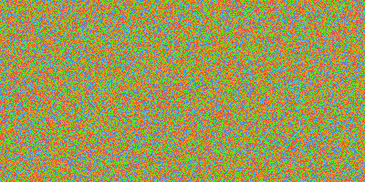

# Goalign: toolkit and api for alignment manipulation

## Commands

### draw
This command draws alignments with basic functionalities. So far, output format is html, using [BioJS](http://msa.biojs.net/) library, and PNG displaying one sequence per line and one pixel per character.

If the input file contains several alignments, it will write several output files.

#### Usage
* general command:
```
Usage:
  goalign draw [command]

Available Commands:
  biojs       Draw alignments in html file using msaviewer from biojs
  png         Draw alignments in a png file

Flags:
  -o, --output string   Alignment draw output file (default "stdout")

Global Flags:
  -i, --align string    Alignment input file (default "stdin")
      --auto-detect     Auto detects input format (overrides -p and -x)
      --input-strict    Strict phylip input format (only used with -p)
  -x, --nexus           Alignment is in nexus? default fasta
      --output-strict   Strict phylip output format (only used with -p)
  -p, --phylip          Alignment is in phylip? default fasta
```

* biojs subcommand
```
Usage:
  goalign draw biojs [flags]

Global Flags:
  -i, --align string    Alignment input file (default "stdin")
      --auto-detect     Auto detects input format (overrides -p and -x)
      --input-strict    Strict phylip input format (only used with -p)
  -x, --nexus           Alignment is in nexus? default fasta
  -o, --output string   Alignment draw output file (default "stdout")
  -p, --phylip          Alignment is in phylip? default fasta
```

* png subcommand
```
Usage:
  goalign draw png [flags]

Global Flags:
  -i, --align string    Alignment input file (default "stdin")
      --auto-detect     Auto detects input format (overrides -p and -x)
      --input-strict    Strict phylip input format (only used with -p)
  -x, --nexus           Alignment is in nexus? default fasta
  -o, --output string   Alignment draw output file (default "stdout")
  -p, --phylip          Alignment is in phylip? default fasta
```
#### Examples

* Generating a random alignment and displaying it in html
```
goalign random -l 10 --seed 10 | goalign draw biojs -o al.html
```
Should give the following alignment:


* Generating a random nucleotide alignment and displaying it in png
```
goalign random -l 10 --seed 10 | goalign draw png -o al.png
```
Should give the following image:
